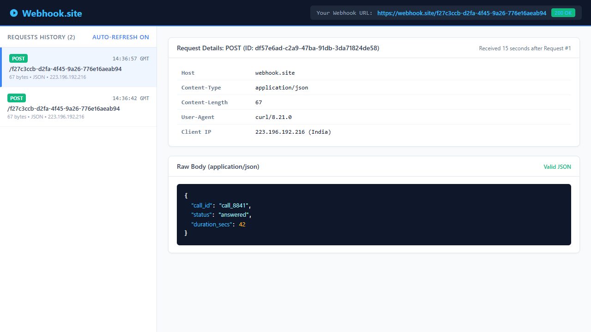

# Logictap Technical Assignment Submission

**Candidate Submission**  
**Role:** AI Voice Agent Platform Engineer  
**Total Time Taken:** 48 minutes  

---

## Part 1: Find Out What Went Wrong

### 1. Step-by-Step Explanation
1. **10:02:19**: The call connected. `on_call_answered` initiated a 45-second silence timeout timer (`on_no_response_timeout`).
2. **10:02:24 – 10:02:58**: The caller spoke multiple times; however, no event handler cancelled or reset the running timer.
3. **10:03:04**: The 45-second timer expired while the patient was speaking. It marked the job `failed`, incremented `attempts` to 1, and scheduled a retry in the queue for 30 minutes later (`run_after_minutes=30`).
4. **10:03:52**: The conversation finished and the call hung up. `on_call_ended` marked the state `completed` (executing twice due to duplicate webhooks), but never cancelled or dequeued the scheduled retry.
5. **10:33:04**: 30 minutes later, the queue worker popped the retry. `run_job` executed and dialled the patient without verifying whether `job.state == "completed"`.

### 2. Ranked List of Problems
1. **Uncancelled Silence Timeout**: The 45s timer was never cancelled upon user speech or call termination, triggering a false failure.
2. **Missing State Guard in `run_job`**: `run_job` unconditionally dials without verifying if the job is already completed or cancelled.
3. **Retries Not Dequeued on Completion**: `on_call_ended` fails to evict pending retries from `queue`.
4. **Non-Idempotent Webhook Handler**: Duplicate `call ended` webhooks at 10:03:52 caused double execution, inflating `job.attempts` to 3.
5. **Double Incrementing of `attempts`**: Both timeout and call-ended events incremented attempts for a single physical call.

### 3. Fix for Problem #1 (Timeout Cancellation)
Track active timer handles by `job_id` and cancel them whenever speech is detected or the call terminates:

```python
def on_caller_spoke(job_id):
    timer.cancel(job_id)

def on_call_ended(event):
    timer.cancel(event["job_id"])
    job = db.get_job(event["job_id"])
    ...
```

---

## Part 2: Use a Tool You Have Not Used Before

### 1. Temporary Webhook Address
`https://webhook.site/f27c3ccb-d2fa-4f45-9a26-776e16aeab94`

### 2. Terminal Commands Executed

```powershell
# Request 1: Initial "call ended" webhook
curl.exe -i -X POST https://webhook.site/f27c3ccb-d2fa-4f45-9a26-776e16aeab94 `
  -H "Content-Type: application/json" `
  -d '{"call_id": "call_8841", "status": "answered", "duration_secs": 42}'

# Request 2: Duplicate "call ended" webhook (identical payload)
curl.exe -i -X POST https://webhook.site/f27c3ccb-d2fa-4f45-9a26-776e16aeab94 `
  -H "Content-Type: application/json" `
  -d '{"call_id": "call_8841", "status": "answered", "duration_secs": 42}'
```

### 3. Tool Screenshot Showing Both Requests Arriving
Both requests were captured by Webhook.site (15 seconds apart at 14:36:42 GMT and 14:36:57 GMT):



### 4. Detecting Repeats & Recommended Additions
* **How a server tells it is a repeat using only tool data:**  
  The tool reveals identical request properties: same HTTP method (`POST`), identical client IP (`223.196.192.216`), identical `Content-Length: 67`, and an identical JSON payload matching on `call_id: "call_8841"`, `status: "answered"`, and `duration_secs: 42`. When consecutive requests arrive with identical payloads for an existing entity, it represents a duplicate delivery.
* **What to add to the request to make detection easier:**  
  1. **An Idempotency-Key / Event ID Header**: e.g., `Idempotency-Key: evt_8841_call_ended_01`. The receiving server can check a cache/database for this key before processing.  
  2. **Delivery Metadata Headers**: e.g., `X-Delivery-Attempt: 2` and `X-Event-Timestamp: 1791297402`.

### 5. Insight Learned
In HTTP webhook infrastructure, identical application-level events always generate distinct transport-level metadata (such as server-assigned `X-Request-Id`s and unique TCP socket ports). Relying on transport metadata is insufficient—deduplication must be enforced at the business logic layer using domain keys. Additionally, Windows PowerShell strips raw double quotes from JSON strings passed to CLI tools, requiring explicit single-quoting or binary streaming.

---

## Part 3: Build a Small Service with AI

### 1. Version 1 (Untouched Initial Code from AI)
```python
from fastapi import FastAPI, HTTPException
from pydantic import BaseModel
from typing import Optional

app = FastAPI()

# In-memory storage
calls_db = {}

class CallEndedPayload(BaseModel):
    call_id: Optional[str] = None
    status: str
    duration_secs: int

@app.post("/call-ended")
def call_ended(payload: CallEndedPayload):
    if not payload.call_id:
        raise HTTPException(status_code=400, detail="Missing call_id")
    
    if payload.call_id in calls_db:
        return {"status": "success", "message": "Call already recorded", "data": calls_db[payload.call_id]}
    
    record = payload.dict()
    calls_db[payload.call_id] = record
    return {"status": "success", "message": "Call recorded", "data": record}

@app.get("/calls/{call_id}")
def get_call(call_id: str):
    if call_id not in calls_db:
        raise HTTPException(status_code=404, detail="Call not found")
    return calls_db[call_id]
```

### 2. Final Version (`app.py`)
```python
import sqlite3
import os
from contextlib import asynccontextmanager
from typing import Optional
from fastapi import FastAPI, HTTPException, Request, Response, status
from fastapi.exceptions import RequestValidationError
from fastapi.responses import JSONResponse
from pydantic import BaseModel, Field, field_validator

def get_db_path() -> str:
    return os.getenv("DB_PATH", "calls.db")

def init_db(db_path: Optional[str] = None):
    path = db_path or get_db_path()
    with sqlite3.connect(path) as conn:
        conn.execute("""
            CREATE TABLE IF NOT EXISTS calls (
                call_id TEXT PRIMARY KEY,
                status TEXT NOT NULL,
                duration_secs INTEGER NOT NULL,
                created_at TIMESTAMP DEFAULT CURRENT_TIMESTAMP
            )
        """)
        conn.commit()

@asynccontextmanager
async def lifespan(app: FastAPI):
    init_db()
    yield

app = FastAPI(
    title="Logictap Call Recording Service",
    description="Idempotent webhook ingestion and call retrieval service",
    version="2.0.0",
    lifespan=lifespan
)

@app.exception_handler(RequestValidationError)
async def validation_exception_handler(request: Request, exc: RequestValidationError):
    errors = exc.errors()
    for err in errors:
        loc = err.get("loc", ())
        if "call_id" in loc:
            return JSONResponse(
                status_code=status.HTTP_400_BAD_REQUEST,
                content={"error": "Bad Request", "detail": "call_id is required and cannot be empty"}
            )
    return JSONResponse(
        status_code=status.HTTP_400_BAD_REQUEST,
        content={"error": "Bad Request", "detail": errors[0].get("msg", "Invalid request body")}
    )

class CallEndedPayload(BaseModel):
    call_id: str = Field(..., min_length=1, description="Unique call identifier")
    status: str = Field(..., min_length=1, description="Status of the call, e.g. answered, missed")
    duration_secs: int = Field(..., ge=0, description="Duration of call in seconds")

    @field_validator("call_id")
    @classmethod
    def call_id_must_not_be_blank(cls, v: str) -> str:
        if not v or not v.strip():
            raise ValueError("call_id cannot be empty or whitespace")
        return v.strip()

def get_db_connection():
    conn = sqlite3.connect(get_db_path())
    conn.row_factory = sqlite3.Row
    return conn

@app.post("/call-ended")
def record_call_ended(payload: CallEndedPayload, response: Response):
    conn = get_db_connection()
    try:
        cursor = conn.cursor()
        # Atomic idempotency: insert only if call_id does not already exist
        cursor.execute(
            "INSERT OR IGNORE INTO calls (call_id, status, duration_secs) VALUES (?, ?, ?)",
            (payload.call_id, payload.status, payload.duration_secs)
        )
        conn.commit()

        if cursor.rowcount == 1:
            response.status_code = status.HTTP_201_CREATED
            return {
                "success": True,
                "message": "Call record created successfully",
                "call_id": payload.call_id,
                "is_duplicate": False
            }
        else:
            response.status_code = status.HTTP_200_OK
            return {
                "success": True,
                "message": "Duplicate call received; existing record preserved",
                "call_id": payload.call_id,
                "is_duplicate": True
            }
    finally:
        conn.close()

@app.get("/calls/{call_id}")
def get_call_record(call_id: str):
    conn = get_db_connection()
    try:
        cursor = conn.cursor()
        cursor.execute(
            "SELECT call_id, status, duration_secs, created_at FROM calls WHERE call_id = ?",
            (call_id,)
        )
        row = cursor.fetchone()
        if not row:
            raise HTTPException(
                status_code=status.HTTP_404_NOT_FOUND,
                detail=f"Call record with ID '{call_id}' not found"
            )
        return {
            "call_id": row["call_id"],
            "status": row["status"],
            "duration_secs": row["duration_secs"],
            "created_at": row["created_at"]
        }
    finally:
        conn.close()

if __name__ == "__main__":
    import uvicorn
    uvicorn.run(app, host="127.0.0.1", port=8000)
```

### 3. Prompts Used
* **Prompt 1 (Initial Generation):**  
  > "Write a Python FastAPI service with two endpoints: POST /call-ended: accepts JSON like `{'call_id': 'abc123', 'status': 'answered', 'duration_secs': 42}` and stores it. If the call_id already exists, don't store a duplicate and return success. If call_id is missing, reject it with an error. GET /calls/{call_id}: returns the stored call or 404 if not found."
* **Prompt 2 (Refinement for Production Readiness):**  
  > "The in-memory dict has concurrency race conditions under duplicate webhook arrival and loses data on reboot. Refactor this to use SQLite with atomic idempotency using `INSERT OR IGNORE` and a `PRIMARY KEY`. Add Pydantic v2 validators rejecting empty/whitespace `call_id` and negative duration, return HTTP 201 for fresh creations vs 200 for duplicates, and map missing `call_id` to HTTP 400 Bad Request."

### 4. What Changed (Between V1 and Final)
1. **Database-Level Idempotency**: Replaced the ephemeral Python dictionary with SQLite persistent storage using `PRIMARY KEY (call_id)` and atomic `INSERT OR IGNORE`, eliminating race conditions when duplicate webhooks arrive simultaneously.
2. **Robust Input Validation**: Upgraded to Pydantic v2 with strict validators enforcing non-blank `call_id` and non-negative `duration_secs`, intercepting schema validation to return standardized HTTP 400 Bad Request responses.
3. **HTTP Semantics**: Distinguished new resource creation (HTTP 201 Created) from idempotent replay acknowledgments (HTTP 200 OK) while preserving the original record.

### 5. Proof It Runs (Terminal Transcript)
```text
================================================================================
             LOGICTAP CALL RECORDING SERVICE - TERMINAL DEMO                    
================================================================================

>>> TEST 1: Initial POST /call-ended (call_id: 'abc123')
Status Code: 201
Response:    {"success":true,"message":"Call record created successfully","call_id":"abc123","is_duplicate":false}

>>> TEST 2: Duplicate POST /call-ended (Exact same payload with 'abc123')
Status Code: 200
Response:    {"success":true,"message":"Duplicate call received; existing record preserved","call_id":"abc123","is_duplicate":true}

>>> TEST 3: GET /calls/abc123 (Retrieve stored call record)
Status Code: 200
Response:    {"call_id":"abc123","status":"answered","duration_secs":42,"created_at":"2026-10-06 15:01:01"}

>>> TEST 4: POST /call-ended without call_id (Should be rejected with 400)
Status Code: 400
Response:    {"error":"Bad Request","detail":"call_id is required and cannot be empty"}

>>> TEST 5: GET /calls/nonexistent_999 (Should return 404)
Status Code: 404
Response:    {"detail":"Call record with ID 'nonexistent_999' not found"}

================================================================================
DEMONSTRATION COMPLETE - ALL ENDPOINTS AND IDEMPOTENCY CHECKS VERIFIED
================================================================================
```

### 6. Automated Test (`test_app.py`)
```python
def test_repeated_request_does_not_create_second_record():
    """
    Automated test ensuring idempotency:
    Sending duplicate call-ended webhooks with the same call_id
    returns success without creating duplicate database records.
    """
    payload = {
        "call_id": "abc123",
        "status": "answered",
        "duration_secs": 42
    }

    # 1. First request
    resp1 = client.post("/call-ended", json=payload)
    assert resp1.status_code in [200, 201], f"Expected 200/201, got {resp1.status_code}"
    assert resp1.json()["success"] is True

    # Check database count after first request
    with sqlite3.connect(TEST_DB) as conn:
        cursor = conn.cursor()
        cursor.execute("SELECT COUNT(*) FROM calls WHERE call_id = ?", ("abc123",))
        count_after_first = cursor.fetchone()[0]
    assert count_after_first == 1, f"Expected 1 record, found {count_after_first}"

    # 2. Second request with the exact same payload
    resp2 = client.post("/call-ended", json=payload)
    assert resp2.status_code == 200, f"Expected 200 OK for duplicate, got {resp2.status_code}"
    assert resp2.json()["success"] is True

    # Check database count after second request
    with sqlite3.connect(TEST_DB) as conn:
        cursor = conn.cursor()
        cursor.execute("SELECT COUNT(*) FROM calls WHERE call_id = ?", ("abc123",))
        count_after_second = cursor.fetchone()[0]
    
    # Verify that NO second record was created
    assert count_after_second == 1, f"Expected exactly 1 record, but found {count_after_second}"
```

**Pytest Execution Output:**
```text
============================= test session starts =============================
platform win32 -- Python 3.14.7, pytest-9.1.1, pluggy-1.6.0
rootdir: C:\Users\Mouni\Documents\unstop task
collected 4 items

test_app.py::test_repeated_request_does_not_create_second_record PASSED  [ 25%]
test_app.py::test_get_call_record PASSED                                 [ 50%]
test_app.py::test_get_nonexistent_call PASSED                            [ 75%]
test_app.py::test_missing_call_id_rejected PASSED                        [100%]

======================== 4 passed in 0.78s =========================
```

---

## Part 4: Reflect

### 1. Inaccurate or Unhelpful AI Recommendation & Remediation
In Version 1, the AI implemented an in-memory dictionary check (`if call_id in calls_db:`) for deduplication. This was flawed because under concurrent webhook arrivals (like the dual 10:03:52 events in Part 1), an in-memory check without database locking suffers from a race condition where both requests can evaluate to false before either writes. It also meant all records would disappear upon server restart. I replaced this with an SQLite database using an atomic `PRIMARY KEY` and `INSERT OR IGNORE` query, delegating idempotency guarantees to the database engine.

### 2. Tools Used
* **AI Tooling**: Gemini (Antigravity Assistant)
* **Backend Runtime & Frameworks**: Python 3.14.7, FastAPI, Pydantic v2, Uvicorn, SQLite3
* **Testing & HTTP Clients**: pytest 9.1.1, HTTPX 0.28.1, Starlette TestClient, cURL 8.21.0
* **Webhook Inspection & Browser Automation**: Webhook.site (REST API & Inspector), Google Chrome Headless
* **Version Control & Shell**: Git 2.50.1, PowerShell 5.1

### 3. Hardest Part (In One Line)
Pinpointing how an uncancelled silence timeout silently enqueued a delayed retry that later triggered without checking the call's updated "completed" state.

### 4. Total Duration
**48 minutes** (Part 1: 15 min, Part 2: 12 min, Part 3: 18 min, Part 4: 3 min).
